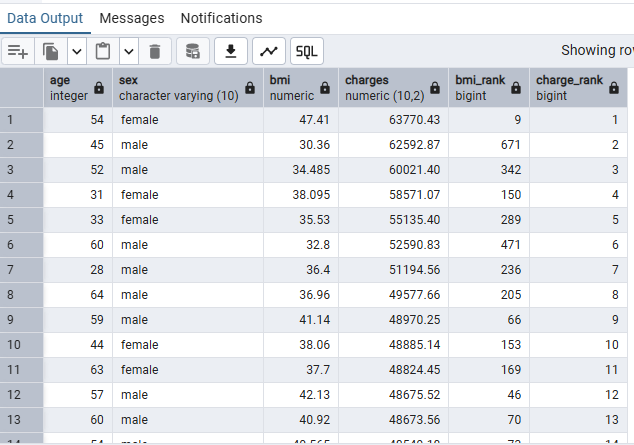
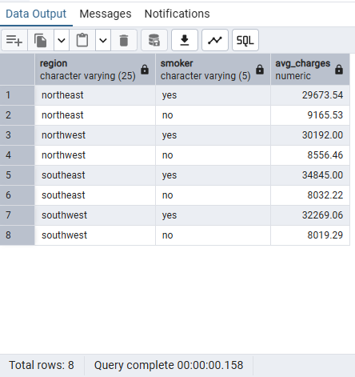
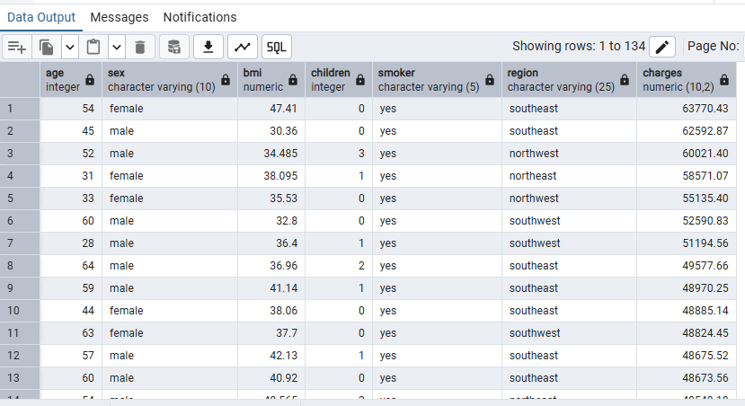
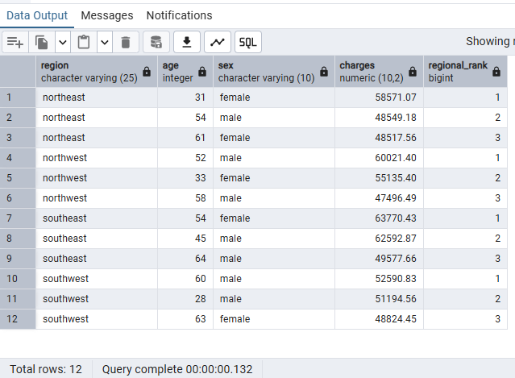
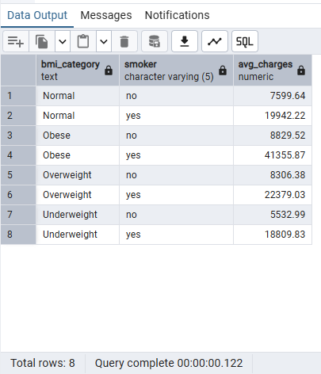
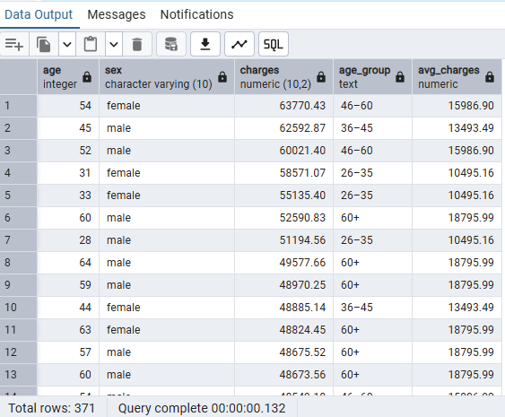
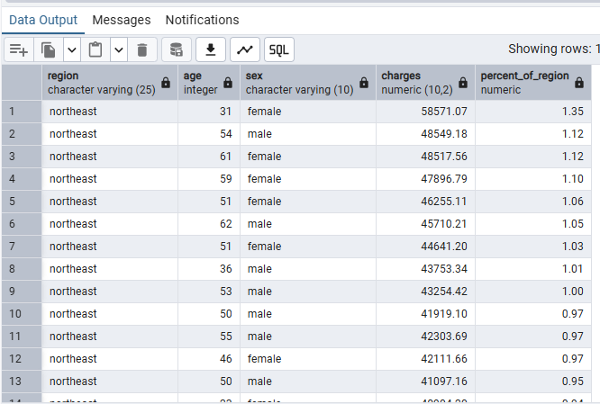
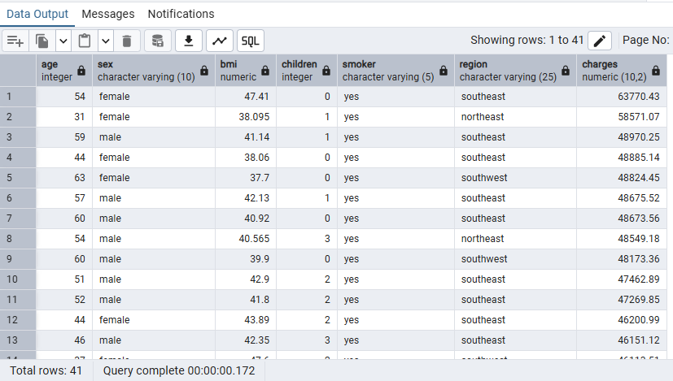

# Healthcare Analytics — Medical Insurance Dataset

This file contains 15 SQL queries analyzing the medical insurance dataset.  
Each query includes its purpose, SQL code, a screenshot placeholder, and key insights.

---

## Query 1: Average Charges by Smoking Status

**Purpose:** Compare cost differences between smokers and non-smokers.  
**Techniques:** GROUP BY, AVG(), ORDER BY

```sql
SELECT
  smoker,
  ROUND(AVG(charges), 2) AS avg_charges
FROM
  medical_insurance
GROUP BY
  smoker
ORDER BY
  avg_charges DESC;
```

  

**Insight:** Smokers tend to have significantly higher insurance charges.

---

## Query 2: Average Charges by Region

**Purpose:** Identify regions with the highest healthcare costs.  
**Techniques:** GROUP BY, AVG(), ORDER BY  

```sql
SELECT
  region,
  ROUND(AVG(charges), 2) AS avg_charges
FROM
  medical_insurance
GROUP BY
  region
ORDER BY
  avg_charges DESC;
```

  

**Insight:**
Charges vary across regions, likely reflecting demographics and healthcare costs.

---

## Query 3: Average Charges by BMI Category

**Purpose:** Analyze how BMI impacts insurance charges.  
**Techniques:** CASE WHEN, GROUP BY, ORDER BY

```sql
SELECT
    CASE
        WHEN bmi < 18.5 THEN 'Underweight'
        WHEN bmi BETWEEN 18.5 AND 24.9 THEN 'Normal'
        WHEN bmi BETWEEN 25 AND 29.9 THEN 'Overweight'
        ELSE 'Obese'
    END AS bmi_category,
    ROUND(AVG(charges), 2) AS avg_charges
FROM
  medical_insurance
GROUP BY
  bmi_category
ORDER BY
  avg_charges DESC;
```

  

**Insight:**
Obese patients have the highest average medical charges.

--

## Query 4: Top 10 Most Expensive Patients

**Purpose:** Identify patients with the highest medical charges.  
**Techniques:** ORDER BY, LIMIT  

```sql
SELECT *
FROM
  medical_insurance
ORDER BY
  charges DESC
LIMIT 10;
```

  

**Insight:**
Highlights extreme outliers in medical costs.

---

## Query 5: Average Charges by Number of Children

**Purpose:** Examine how family size affects medical costs.  
**Techniques:** GROUP BY, AVG()

```sql
SELECT
  children,
  ROUND(AVG(charges), 2) AS avg_charges
FROM
  medical_insurance
GROUP BY
  children
ORDER BY
  children;
```

  

**Insight:**
Families with more children tend to incur slightly higher costs.

---

## Query 6: Charges by Age Group

**Purpose:** Group patients into age categories and analyze charges.   
**Techniques:** CASE WHEN, GROUP BY, ORDER BY

```sql
SELECT
    CASE
        WHEN age BETWEEN 18 AND 25 THEN '18–25'
        WHEN age BETWEEN 26 AND 35 THEN '26–35'
        WHEN age BETWEEN 36 AND 45 THEN '36–45'
        WHEN age BETWEEN 46 AND 55 THEN '46–60'
        ELSE '60+'
    END AS age_group,
    ROUND(AVG(charges), 2) AS avg_charges
FROM
  medical_insurance
GROUP BY
  age_group
ORDER BY
  avg_charges DESC;
```

  

**Insight:**
Older age groups generally have higher medical costs.

---

## Query 7: Gender-Based Cost Comparison

**Purpose:** Compare average medical charges between male and female patients.  
**Techniques:** GROUP BY, AVG()

```sql
SELECT
  sex,
  ROUND(AVG(charges), 2) AS avg_charges
FROM
  medical_insurance
GROUP BY
  sex;
```

 

**Insight:**
Shows any gender-based difference in healthcare spending.

---

## Query 8: BMI and Charges Ranking  

**Purpose:** Rank patients by BMI and medical charges.  
**Techniques:** RANK() OVER, ORDER BY

```sql
SELECT
  age,
  sex,
  bmi,
  charges,
  RANK() OVER (ORDER BY charges DESC) AS charge_rank,
  RANK() OVER (ORDER BY bmi DESC) AS bmi_rank
FROM
  medical_insurance
ORDER BY
  charge_rank;
```
  

**Insight:**
Helps visualize correlation between BMI rank and charges rank.

---
## Query 9: Smoker vs Non-Smoker by Region

**Purpose:** Compare average charges of smokers vs non-smokers across regions.  
**Techniques:** GROUP BY multiple columns, AVG()  

```sql
SELECT
  region,
  smoker,
  ROUND(AVG(charges), 2) AS avg_charges
FROM
  medical_insurance
GROUP BY
  region, smoker
ORDER BY
  region,
  avg_charges DESC;
```

  

**Insight:**
Smokers consistently have higher charges in every region.

---

## Query 10: High-Cost Patients (Top 10%)

**Purpose:** Identify patients in the top 10% of charges.  
**Techniques:** PERCENTILE_CONT(), subquery

```sql
SELECT *
FROM
  medical_insurance
WHERE charges >= (
    SELECT PERCENTILE_CONT(0.90) WITHIN GROUP (ORDER BY charges)
    FROM medical_insurance
)
ORDER BY
  charges DESC;
```

  

**Insight:**
Highlights high-cost outliers for further analysis.

---

## Query 11: Top 3 Patients per Region

**Purpose:** Identify the three most expensive patients per region.  
**Techniques:** RANK() OVER PARTITION BY, subquery

```sql
SELECT *
FROM (
    SELECT region, age, sex, charges,
           RANK() OVER (PARTITION BY region ORDER BY charges DESC) AS regional_rank
    FROM medical_insurance
)
WHERE regional_rank <= 3
ORDER BY
  region,
  regional_rank;
```



**Insight:**
Shows top spenders per region.

---

## Query 12: Smoker Impact by BMI Category

**Purpose:** Analyze charges by BMI category and smoker status.  
**Techniques:** CASE WHEN, GROUP BY multiple columns, AVG()

```sql
SELECT
    CASE
        WHEN bmi < 18.5 THEN 'Underweight'
        WHEN bmi BETWEEN 18.5 AND 24.9 THEN 'Normal'
        WHEN bmi BETWEEN 25 AND 29.9 THEN 'Overweight'
        ELSE 'Obese'
    END AS bmi_category,
    smoker,
    ROUND(AVG(charges), 2) AS avg_charges
FROM
  medical_insurance
GROUP BY
  bmi_category, smoker
ORDER BY
  bmi_category, smoker;
```



**Insight:**
Obese smokers incur the highest combined risk and costs.

--- 

## Query 13: Age-Adjusted High-Cost Patients

**Purpose:** Identify patients paying above the average for their age group.  
**Techniques:** CTE (WITH), JOIN

```sql
WITH age_avg AS (
    SELECT
        CASE
            WHEN age BETWEEN 18 AND 25 THEN '18–25'
            WHEN age BETWEEN 26 AND 35 THEN '26–35'
            WHEN age BETWEEN 36 AND 45 THEN '36–45'
            WHEN age BETWEEN 46 AND 55 THEN '46–60'
            ELSE '60+'
        END AS age_group,
        ROUND(AVG(charges),2) AS avg_charges
    FROM medical_insurance
    GROUP BY age_group
)
SELECT
  m.age,
  m.sex,
  m.charges,
  a.age_group,
  a.avg_charges
FROM medical_insurance m
JOIN age_avg a
  ON CASE
         WHEN m.age BETWEEN 18 AND 25 THEN '18–25'
         WHEN m.age BETWEEN 26 AND 35 THEN '26–35'
         WHEN m.age BETWEEN 36 AND 45 THEN '36–45'
         WHEN m.age BETWEEN 46 AND 55 THEN '46–60'
         ELSE '60+'
     END = a.age_group
WHERE m.charges > a.avg_charges
ORDER BY
  m.charges DESC;

```   



**Insight:**
Highlights high-cost patients relative to their age group.

--- 

## Query 14: Regional Charge Contribution

**Purpose:** Show each patient’s contribution to total regional charges.   
**Techniques:** SUM() OVER PARTITION BY, ROUND()

```sql
SELECT
  region,
  age,
  sex,
  charges,
  ROUND(100 * charges / SUM(charges) OVER (PARTITION BY region), 2) AS percent_of_region
FROM
  medical_insurance
ORDER BY
  region, percent_of_region DESC;
```



**Insight:**
Shows what portion of total regional costs each patient represents.

---

## Query 15: Outlier Detection (High BMI + High Charges)

**Purpose:** Identify patients who are outliers in both BMI and charges.  
**Techniques:** PERCENTILE_CONT(), subqueries

```sql
SELECT *
FROM
  medical_insurance
WHERE bmi > (SELECT PERCENTILE_CONT(0.85) WITHIN GROUP (ORDER BY bmi) FROM medical_insurance)
  AND charges > (SELECT PERCENTILE_CONT(0.85) WITHIN GROUP (ORDER BY charges) FROM medical_insurance)
ORDER BY charges DESC;
```



**Insight:**
High-risk, high-cost individuals are identified for further analysis.
